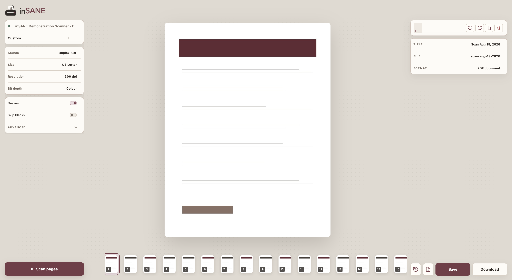

<p align="center">
  
</p>

inSANE is a functional, modern web frontend for [NAPS2.Sdk](https://github.com/cyanfish/naps2/tree/master/NAPS2.Sdk). It simplifies multi-user access to scanners and supports direct output to a [paperless-ngx](https://github.com/paperless-ngx/paperless-ngx) [consume directory](https://docs.paperless-ngx.com/usage/#the-consumption-directory). Most NAPS2 functionality is included, with focused omissions that keep the interface centred on a streamlined scanning process.

<p align="center">
  
  <br>
  <em>A screenshot of the inSANE demo environment</em>
</p>

## What is implemented

- NAPS2-backed SANE and eSCL/AirScan device discovery in the Linux container.
- Device-reported source discovery for flatbed, feeder, and hardware duplex,
  with resolution, bit-depth, and page-size choices recalculated per source.
- Exact NAPS2 page sizes, including US Letter at 8.5 x 11 inches, plus
  automatic sizing when the driver reports a maximum scan area. Automatic mode
  scans that area and removes a contrasting scanner background from each page.
- Full per-device profile management: create, rename, update, duplicate,
  delete, apply, and choose a physical-button default.
- Advanced NAPS2 scan controls for brightness, contrast, blank-page white
  threshold, and blank-page coverage threshold.
- Asynchronous scan jobs whose pages accrue into persistent document sessions.
- A live page filmstrip, selected-page canvas, single- and multi-page 90-degree
  rotation, normalized crop, persisted drag-to-reorder, page removal, PDF
  completion, direct browser download, and document history.
- Atomic PDF and multi-page TIFF publication: the document is fully exported
  within `/data/output` before it receives its final file name.
- ZIP export with one processed PNG or JPEG per page, preserving document order,
  rotation, and crop settings for both bind-mount saves and browser downloads.
- The browser does not expose an output-folder picker. Server saves always use
  the configured `/data/output` bind mount; browser downloads return a
  temporary PDF, TIFF, or ZIP copy directly to the current browser instead.
- Shift-click page-range selection for non-destructive document splitting.
  Bind-mount saves create a separate history record for the selected pages and
  leave the source session open for the next split.
- Structured scan failures with recovery guidance and one-click retry; pages
  received before an interruption remain in the current document.
- A token-protected scanner-button action compatible with a scanbd/scanbm
  Docker bridge.

## Docker Compose

### Minimal demo

This is the smallest useful Compose file for trying inSANE without a scanner.
It preserves sessions and completed documents in local bind mounts:

```yaml
services:
  insane:
    image: docker.io/angeladmerkel/insane:1.0.0-amd64
    ports:
      - "51234:8080"
    volumes:
      - ./data/state:/data/state
      - ./data/output:/data/output
    environment:
      InSane__Scanner__EnableDemo: "true"
```

### Physical USB scanner

For a scanner attached directly to a Linux Docker host, disable the demo by
omitting `InSane__Scanner__EnableDemo` and grant the container USB access:

```yaml
services:
  insane:
    image: docker.io/angeladmerkel/insane:1.0.0-amd64
    restart: unless-stopped
    privileged: true
    ports:
      - "51234:8080"
    volumes:
      - ./data/state:/data/state
      - ./data/output:/data/output
    environment:
      PUID: "568"
      PGID: "568"
```

`privileged: true` is not required for the demonstration scanner or for a
network eSCL/AirScan device.

### Compose service options

| Option | Required | Purpose |
| --- | --- | --- |
| `image` | Yes, unless using `build` | Image to run. The currently published image is `docker.io/angeladmerkel/insane:1.0.0-amd64`. |
| `build` | No | Builds from a local repository checkout. Use this instead of the published image workflow; do not combine it with `pull_policy: always`. |
| `ports` | Yes for direct browser access | Maps a host port to inSANE's container port `8080`, for example `51234:8080`. |
| `volumes` | Strongly recommended | `/data/state` stores profiles, sessions, page images, and recovery state. `/data/output` receives completed documents. |
| `restart` | No | `unless-stopped` is recommended for an unattended server. |
| `privileged` | USB only | Grants broad hardware access for scanners attached to the Docker host. Omit it for demo and network-only scanning. |
| `platform` | Usually no | The published image is `linux/amd64`. Native AMD64 hosts select it automatically; `platform: linux/amd64` is only needed when intentionally using emulation on another architecture. |
| `pull_policy` | No | The default policy is sufficient with a versioned tag. Use `always` only when deliberately tracking a mutable tag. |
| `init` | No | Adds a small PID 1 that forwards signals and reaps child processes. The image runs without it. |
| `container_name` | No | Assigns a fixed Docker container name. Compose otherwise generates one from the project and service names. |

The image supplies a health check and defaults its internal storage paths to
`/data/state` and `/data/output`, so these do not need to be repeated in
Compose.

### inSANE environment variables

| Variable | Default | Purpose |
| --- | --- | --- |
| `PUID` | `568` | UID used to run inSANE and own files in the mounted directories. Set it to the host identity that should own the files. |
| `PGID` | `568` | GID used to run inSANE and provide shared access to mounted directories. |
| `InSane__Storage__StatePath` | `/data/state` | Absolute container path for persistent application state. Change it only when also changing the volume target. |
| `InSane__Storage__OutputPath` | `/data/output` | Absolute container path for completed documents. It may be a consume directory shared with another application. |
| `InSane__Scanner__EnableDemo` | `false` | Enables the hardware-free demonstration scanner. |
| `InSane__Scanner__EsclSearchTimeoutMilliseconds` | `5000` | Maximum time in milliseconds allowed for eSCL/AirScan discovery. |
| `InSane__Scanner__PhysicalButtonEnabled` | `false` | Enables the authenticated scanner-button HTTP action used by an external scanbd/scanbm bridge. |
| `InSane__Scanner__PhysicalButtonToken` | empty | Shared token for the scanner-button action. A non-empty token is required when physical-button integration is enabled. |

## Keyboard shortcuts

| Shortcut | Action |
| --- | --- |
| `Cmd/Ctrl + N` | Start a new document |
| `Cmd/Ctrl + S` | Save to the configured output mount |
| `Cmd/Ctrl + Shift + S` | Download the current document |
| `Cmd/Ctrl + Enter` | Start or cancel scanning |
| `Cmd/Ctrl + A` | Select every page |
| `Cmd/Ctrl +` / `Cmd/Ctrl -` | Zoom the document canvas in or out |
| `Left` / `Right` | Move between pages |
| `Shift + Left` / `Shift + Right` | Extend the page selection |
| `[` / `]` | Rotate the current page or selected pages left or right |
| `C` | Open or close crop mode |
| `Enter` | Apply the active crop |
| `Escape` | Cancel crop mode or clear the page selection |
| `Backspace` / `Delete` | Remove the current page |
